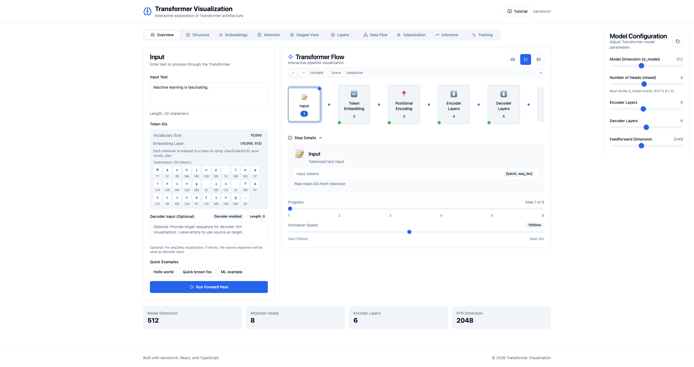
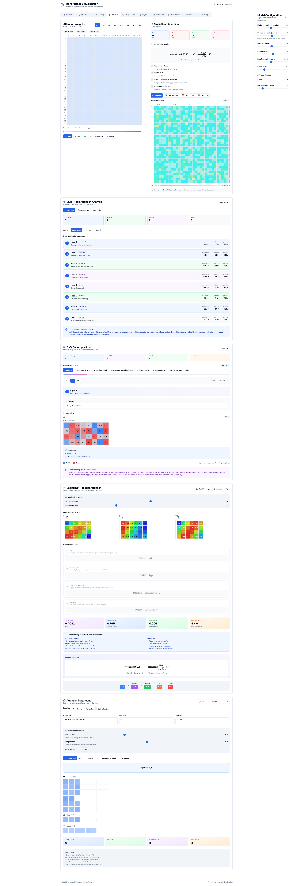
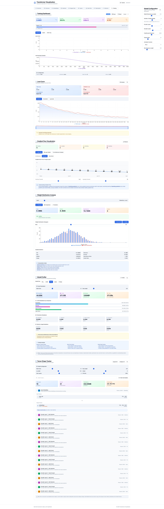

# nanotorch

A minimal PyTorch implementation from scratch with interactive visualization, designed for educational purposes.

[](https://opensource.org/licenses/MIT)
[](https://www.python.org/)

## Overview

nanotorch is a lightweight implementation of core PyTorch functionality built entirely from scratch using only NumPy. It provides:

- **Tensors** with automatic differentiation and 85+ operations
- **Neural Network Layers**: Linear, Conv1D/2D/3D, ConvTranspose2D/3D, RNN/LSTM/GRU, Transformer
- **Normalization**: BatchNorm1d/2d/3d, LayerNorm, GroupNorm, InstanceNorm1d/2d/3d
- **Activation Functions**: ReLU, GELU, SiLU, LeakyReLU, ELU, PReLU, Softplus, etc.
- **Pooling**: MaxPool1d/2d/3d, AvgPool1d/2d/3d, AdaptiveAvgPool2d, AdaptiveMaxPool2d
- **Loss Functions**: MSE, L1Loss, SmoothL1Loss, CrossEntropyLoss, BCELoss, BCEWithLogitsLoss, NLLLoss
- **Optimizers**: SGD, Adam, AdamW, RMSprop, Adagrad
- **LR Schedulers**: StepLR, CosineAnnealingLR, LinearWarmup, CosineWarmupScheduler, etc.
- **Data Utilities**: DataLoader, Dataset, TensorDataset, random_split
- **Data Augmentation**: RandomCrop, RandomFlip, ColorJitter, RandomErasing, etc.
- **Model Serialization**: save/load state dicts
- **🆕 Interactive Web Visualization**: Explore transformer architecture interactively

## Web Visualization

nanotorch includes an interactive web application for visualizing and understanding transformer architecture. The visualization provides:

### Features

- **Overview Dashboard**: Quick stats and transformer flow visualization
- **3D Structure View**: Interactive 3D model of transformer architecture
- **Embedding Visualization**: Token embeddings, positional encoding, and semantic arithmetic demos
- **Attention Exploration**: Multi-head attention, QKV decomposition, attention patterns
- **Layer-by-Layer Breakdown**: Step-by-step computation through transformer layers
- **Data Flow Diagrams**: Sankey diagrams showing tensor flow through the network
- **Training Monitoring**: Loss curves, gradient flow, weight distribution, and profiling
- **Inference Process**: Auto-regressive generation, beam search, sampling strategies
- **Tokenization Tools**: Character/word/BPE tokenization comparison

### Running the Web App

```bash
# From project root
cd frontend
npm install
npm run dev

# Or for production build
npm run build
npm run preview
```

Then open `http://localhost:5173` in your browser.

### Visualization Tabs

| Tab | Description |
|-----|-------------|
| **Overview** | Model configuration, transformer flow, quick statistics |
| **Structure** | 3D architecture visualization, model comparisons |
| **Embeddings** | Token embeddings, positional encoding, semantic arithmetic |
| **Attention** | Attention matrices, multi-head analysis, QKV decomposition |
| **Staged View** | Step-by-step attention computation with flow diagrams |
| **Layers** | Detailed layer visualization with intermediate results |
| **Data Flow** | Sankey diagrams of tensor transformations |
| **Tokenization** | Token-to-text mapping, vocabulary browser |
| **Inference** | Sampling strategies, beam search, generation visualization |
| **Training** | Loss curves, gradients, weights, model profiling |

## Installation

```bash
# Clone repository
git clone https://github.com/qxhy123/nanotorch.git
cd nanotorch

# Install with uv (recommended)
uv venv
source .venv/bin/activate
uv sync

# Or with pip
pip install -e .
```

## Quick Start

### Basic Neural Network

```python
import numpy as np
from nanotorch import Tensor
from nanotorch.nn import Linear, ReLU, Sequential, CrossEntropyLoss
from nanotorch.optim import SGD

# Create model
model = Sequential(
    Linear(784, 128),
    ReLU(),
    Linear(128, 10)
)

# Sample data
X = Tensor.randn((100, 784))
y = Tensor(np.random.randint(0, 10, (100,)))

# Training setup
criterion = CrossEntropyLoss()
optimizer = SGD(model.parameters(), lr=0.01)

# Training loop
for epoch in range(100):
    predictions = model(X)
    loss = criterion(predictions, y)

    optimizer.zero_grad()
    loss.backward()
    optimizer.step()

    if epoch % 10 == 0:
        print(f"Epoch {epoch}, Loss: {loss.item():.4f}")
```

### Transformer

```python
from nanotorch.nn import TransformerEncoderLayer, TransformerEncoder, Embedding

# Create transformer encoder
encoder_layer = TransformerEncoderLayer(d_model=512, nhead=8, dim_feedforward=2048)
encoder = TransformerEncoder(encoder_layer, num_layers=6)

# Embedding layer
embedding = Embedding(num_embeddings=10000, embedding_dim=512)

# Forward pass
tokens = Tensor(np.random.randint(0, 10000, (32, 100)))  # (batch, seq_len)
x = embedding(tokens)
output = encoder(x)
```

## Available Components

### Neural Network Layers

| Layer | Description |
|-------|-------------|
| `Linear` | Fully connected layer |
| `Conv1D/2D/3D` | Convolution layers |
| `ConvTranspose2D/3D` | Transposed convolution |
| `Embedding` | Token embedding layer |
| `RNN` | Vanilla RNN |
| `LSTM` | Long Short-Term Memory |
| `GRU` | Gated Recurrent Unit |
| `TransformerEncoder` | Transformer encoder |
| `MultiheadAttention` | Multi-head attention |

### Normalization Layers

| Layer | Description |
|-------|-------------|
| `BatchNorm1d/2d/3d` | Batch normalization |
| `LayerNorm` | Layer normalization |
| `GroupNorm` | Group normalization |
| `InstanceNorm1d/2d/3d` | Instance normalization |

### Activation Functions

| Activation | Description |
|------------|-------------|
| `ReLU` | Rectified Linear Unit |
| `GELU` | Gaussian Error Linear Unit |
| `SiLU` | Sigmoid Linear Unit (Swish) |
| `LeakyReLU` | Leaky ReLU |
| `Softmax` | Softmax activation |

### Loss Functions

| Loss | Description |
|------|-------------|
| `MSE` | Mean Squared Error |
| `L1Loss` | Mean Absolute Error |
| `CrossEntropyLoss` | Cross Entropy |
| `BCELoss` | Binary Cross Entropy |
| `BCEWithLogitsLoss` | BCE with sigmoid |

### Optimizers

| Optimizer | Description |
|-----------|-------------|
| `SGD` | Stochastic Gradient Descent |
| `Adam` | Adam optimizer |
| `AdamW` | Adam with decoupled weight decay |
| `RMSprop` | RMSprop optimizer |

## Project Structure

```
nanotorch/
├── nanotorch/              # Core library
│   ├── tensor.py          # Tensor with autograd
│   ├── autograd.py        # Autograd engine
│   ├── nn/                # Neural network modules
│   │   ├── transformer.py # Transformer components
│   │   ├── attention.py
│   │   └── ...
│   ├── optim/             # Optimizers & schedulers
│   ├── data/              # Data utilities
│   └── tokenizer/         # Tokenizer implementations
├── frontend/              # Web visualization app
│   ├── src/
│   │   ├── components/   # React components
│   │   │   └── visualization/
│   │   │       ├── attention/
│   │   │       ├── embedding/
│   │   │       ├── training/
│   │   │       ├── inference/
│   │   │       └── ...
│   │   └── stores/       # State management
│   └── package.json
├── backend/               # FastAPI backend for visualization
│   └── app/
│       └── api/
│           └── routes/   # API endpoints
├── tests/                 # Test suite
├── examples/              # Example scripts
├── docs/                  # Documentation
└── pyproject.toml
```

## Testing

```bash
# Run all tests
python -m pytest tests/ -v

# Run with coverage
python -m pytest tests/ --cov=nanotorch
```

## Screenshots

### Web Visualization


*Overview dashboard with transformer flow*


*Multi-head attention visualization*


*Training metrics and loss curves*

## Limitations

- CPU-only (no GPU support)
- Limited operations compared to PyTorch
- No distributed training

## Contributing

Contributions welcome! Please:

1. Follow existing code style
2. Add tests for new functionality
3. Update documentation
4. Ensure all tests pass

## License

MIT License. See [LICENSE](LICENSE) for details.

## Acknowledgments

- Inspired by PyTorch, micrograd, and tinygrad
- Designed for educational use in understanding deep learning frameworks
- Web visualization built with React, TypeScript, and Recharts

## Citation

```bibtex
@software{nanotorch,
  title = {nanotorch: A minimal PyTorch implementation from scratch with interactive visualization},
  author = {qxhy123},
  year = {2026},
  url = {https://github.com/qxhy123/nanotorch}
}
```

---

[中文文档 (Chinese Documentation)](README_CN.md)
